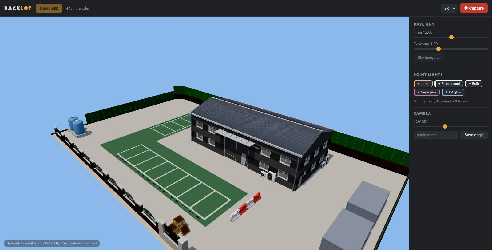
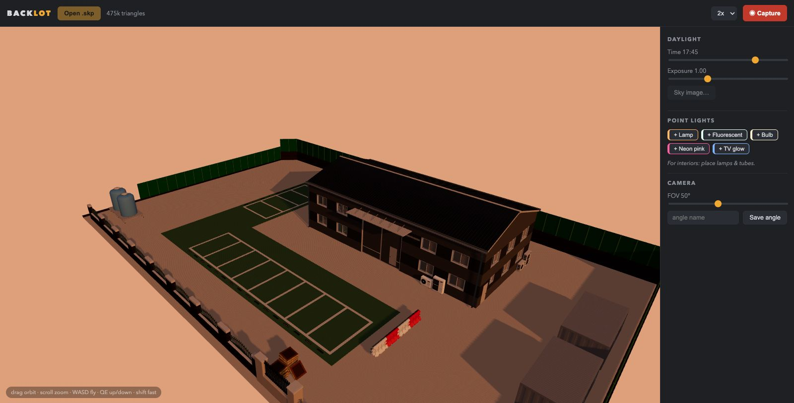
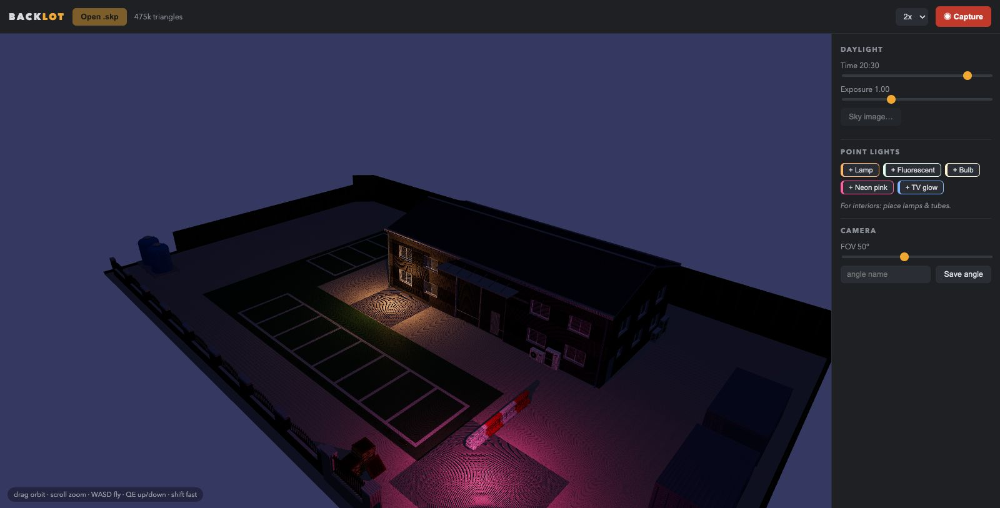

# Backlot

**A fast, friendly viewer for SketchUp scenes — built for webtoon and comic background art.**

Load `.skp` background scenes (ACON3D-style assets or your own), fly around them with
game-style controls, set the time of day, drop in practical lights, and capture
high-resolution screenshots to paint over in Clip Studio Paint.



## Why

Korean-webtoon-style backgrounds are made by rendering a purchased 3D scene from the
exact camera angle a panel needs, then finishing the color render with gradients and
blurs in Clip Studio. SketchUp itself is a modeling tool — navigating it for *shot
hunting* is slow and mouse-hungry, its lighting controls are built for architects, and
it costs a subscription just to keep opening files.

Backlot replaces that part of the pipeline with something that behaves like a game
photo mode: walk into the scene, frame the shot, light it, capture.

## Features

- **Native .skp loading** — opens SketchUp files directly (including old SketchUp 8
  format files, which is what most ACON3D scenes ship as). Converted once, cached,
  ~3 seconds for a 200k-face scene.
- **Game-style navigation** — drag to orbit, scroll to zoom, **WASD** to walk,
  **Q/E** for height, **arrow keys** for precise screen-space panning, **Shift** for speed.
- **FOV control** — 15–100° for wide dramatic shots or flat telephoto looks.
- **Camera bookmarks** — save named angles per scene and jump back to them any time.
  Episode 12 can reuse episode 3's exact framing with one click.
- **Time-of-day daylight** — drag a sun across the sky from night through golden hour
  and back. Ambient color, sun warmth, and real moving shadows follow. Tuned to stay
  *readable* at dusk and night, because these are art backgrounds, not a light meter.
- **Sky images** — drop any PNG/JPG behind the model.
- **Practical point lights** — click-to-place lamps, fluorescents, bulbs, neon, and TV
  glow for interior scenes; per-light color and intensity.
- **Window light** — click a window with the Window preset and a soft, wide,
  shadow-casting light shines into the room (oriented toward where you're standing,
  so it always lights the interior regardless of which way the glass faces).
- **Undo** — Cmd+Z steps back through light placements/edits, daylight changes,
  sky swaps, and bookmark changes.
- **High-res capture** — 1x–4x PNG export of the viewport, ready for Clip Studio.
- **Per-scene memory** — lights, bookmarks, time of day, and sky persist per .skp file.

| Golden hour | Night + practicals |
|---|---|
|  |  |

## Requirements

- macOS on Apple Silicon
- **SketchUp 2026 installed** (a trial or expired install is fine — Backlot links
  against the `SketchUpAPI.framework` that ships inside the SketchUp app bundle, so
  the app must be present at `/Applications/SketchUp 2026/`. No subscription needed.)
- Node 18+ and Rust (build only)

## Build & install

```sh
git clone https://github.com/dragontpe/backlot
cd backlot
./converter/build.sh        # compiles the .skp converter against SketchUp's framework
npm install
npm run tauri build         # produces src-tauri/target/release/bundle/macos/Backlot.app
```

Copy `Backlot.app` to `/Applications`.

## Usage

1. **Open .skp** and pick a scene. First open converts and caches it.
2. Frame your shot: orbit/fly/pan, set FOV. **Save angle** to bookmark the framing.
3. Light it: drag the **Time** slider; for interiors, click a light preset, then click
   a surface to place it — use the **Window** preset on window glass for daylight
   shafting into the room. Adjust color and intensity per light. Cmd+Z undoes.
4. Optional: **Sky image…** to put a sky/cityscape behind the model.
5. Pick capture resolution (2x recommended) and hit **Capture**.

| Key | Action |
|---|---|
| drag | orbit |
| scroll / pinch | zoom |
| right-drag | pan |
| W A S D | fly forward/left/back/right |
| Q / E | down / up |
| ← → ↑ ↓ | precise screen-space pan |
| Shift | 4x speed |
| Cmd+Z | undo |

## How it works

- `converter/skp2obj.c` — a ~400-line C program that reads `.skp` via the official
  SketchUp C API and writes OBJ + MTL + textures. It needs no SDK download: it links
  directly against `SketchUpAPI.framework` inside the installed SketchUp app. Handles
  nested components/groups, material inheritance, mirrored instances (negative-
  determinant transforms get their winding flipped to keep lighting correct), unit
  conversion (inches → meters) and axis conversion (Z-up → Y-up).
- The Tauri (Rust) shell caches conversions per file+mtime, converts TIFF textures to
  PNG (webviews can't decode TIFF), and serves files to the webview.
- The viewer is three.js: ACES tone mapping, PCF soft shadow maps, a stylized
  sun-arc daylight model, and physically-decaying point lights.

### Gotchas learned the hard way

- Every SketchUp C API out-ref **must be zero-initialized** — the API refuses to
  overwrite non-null refs and silently no-ops, after which releasing the ref frees
  stack garbage.
- ACON3D scenes ship as SketchUp 8 format for compatibility; some textures are TIFF
  bytes regardless of file extension — sniff magic bytes, don't trust names.
- A black-rendered surface can be a failed texture *or* inverted lighting from a
  mirrored component. Check texture load failures first; they look identical.

## Roadmap

- Outliner/layer toggles (hide roof to shoot interiors top-down)
- Two-point perspective mode
- GLB cache format (smaller, faster loads)
- Depth/line-art export passes

## License

MIT. SketchUp and the SketchUp C API are Trimble products; this project does not
distribute any Trimble code — it uses the framework from your own SketchUp
installation. Scene files shown in screenshots are commercial assets (ACON3D
"Don't Draw" Modern Background set) and are not included.
